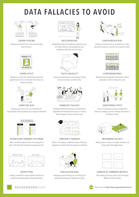

# Data Handling
Here we introduce several blogs related to data and data handling and also some resources of datasets.   
* [Improve Your Data Literacy Skills and Make the Most of Data](https://www.geckoboard.com/learn/data-literacy/) by Geckoboard Company  
  - [Tips for Effective Data Visualization](https://www.geckoboard.com/learn/data-literacy/data-visualization-tips/)  
  - [Common Data Mistakes to Avoid](https://www.geckoboard.com/learn/data-literacy/statistical-fallacies/)  
    
    

  
  Common | Data |  Mistakes | to | Avoid
    -------- | ------- | --------| -----------| ----------
  [Cherry Picking](https://www.geckoboard.com/learn/data-literacy/statistical-fallacies/cherry-picking/) |  [Data Dredging](https://www.geckoboard.com/learn/data-literacy/statistical-fallacies/data-dredging/) | [Survivorship Bias](https://www.geckoboard.com/learn/data-literacy/statistical-fallacies/survivorship-bias/) | [Cobra Effect](https://www.geckoboard.com/learn/data-literacy/statistical-fallacies/cobra-effect/) | [False Causality](https://www.geckoboard.com/learn/data-literacy/statistical-fallacies/false-causality/)
  [Gerrymandering](https://www.geckoboard.com/learn/data-literacy/statistical-fallacies/gerrymandering/) | [Sampling Bias](https://www.geckoboard.com/learn/data-literacy/statistical-fallacies/sampling-bias/) | [Gambler's Fallacy](https://www.geckoboard.com/learn/data-literacy/statistical-fallacies/gamblers-fallacy/) | [Hawthorne Effect](https://www.geckoboard.com/learn/data-literacy/statistical-fallacies/hawthorne-effect/) | [Regression Toward the Mean](https://www.geckoboard.com/learn/data-literacy/statistical-fallacies/regression-toward-the-mean/)  
  [Simpson's Paradox](https://www.geckoboard.com/learn/data-literacy/statistical-fallacies/simpsons-paradox/) | [McNamara Fallacy](https://www.geckoboard.com/learn/data-literacy/statistical-fallacies/mcnamara-fallacy/) | [Overfitting](https://www.geckoboard.com/learn/data-literacy/statistical-fallacies/overfitting/) | [Publication Bias](https://www.geckoboard.com/learn/data-literacy/statistical-fallacies/publication-bias/) | [Danger of Summary Metrics](https://www.geckoboard.com/learn/data-literacy/statistical-fallacies/danger-of-summary-metrics/)
  
## Dealing with Data 
* Slide: [Data Preparation](https://web.fe.up.pt/~ec/files_1112/week_03_Data_Preparation.pdf) by João Mendes Moreira and José Luís Borges    
* Slide: [Data Preprocessing](http://www.csun.edu/~twang/595DM/Slides/Week2.pdf) by Taehyung Wang   
* Slide: [Learning with Missing Labels](https://svivek.com/teaching/machine-learning/fall2018/slides/em/missing-labels.pdf) by Vivek Srikumar  
* Slide: [Data Cleaning and Data Preprocessing](https://www.mimuw.edu.pl/~son/datamining/DM/4-preprocess.pdf) by Nguyen Hung Son    
* Blog: [Applying Wrapper Methods in Python for Feature Selection](https://stackabuse.com/applying-wrapper-methods-in-python-for-feature-selection/) 
by Usman Malik  
* Blog: [Basics of Feature Selection with Python](https://www.kaggle.com/ar2017/basics-of-feature-selection-with-python) by Andika Rachman  
* Blog: [Exhaustive Feature Selector](http://rasbt.github.io/mlxtend/user_guide/feature_selection/ExhaustiveFeatureSelector/) by Sebastian Raschka   
* Blog: [Need for Feature Engineering in Machine Learning](https://towardsdatascience.com/need-for-feature-engineering-in-machine-learning-897df2ed00e6) by Ashish Bansal    
* Blog: [Data Preprocessing](http://www.cs.ccsu.edu/~markov/ccsu_courses/DataMining-3.html) by Zdravko Markov   
* Blog: [How to Handle Correlated Features?](https://www.kaggle.com/reisel/how-to-handle-correlated-features) by Reinhard Sellmair  
* Blog: [5 Ways To Handle Missing Values In Machine Learning Datasets](https://www.analyticsindiamag.com/5-ways-handle-missing-values-machine-learning-datasets/)
* Blog: [Handling Missing Data](http://www.emgo.nl/kc/handling-missing-data/)
* Blog: [How to Handle Missing Data](https://towardsdatascience.com/how-to-handle-missing-data-8646b18db0d4)
* Blog: [7 Techniques to Handle Imbalanced Data](https://www.kdnuggets.com/2017/06/7-techniques-handle-imbalanced-data.html)
* Blog: [Application of Synthetic Minority Over-sampling Technique (SMOTe) for Imbalanced Datasets](https://medium.com/towards-artificial-intelligence/application-of-synthetic-minority-over-sampling-technique-smote-for-imbalanced-data-sets-509ab55cfdaf) by Navoneel Chakrabarty  
* Paper: [SMOTE: Synthetic Minority Over-sampling Technique](https://arxiv.org/pdf/1106.1813.pdf) by Nitesh V. Chawla, Kevin W. Bowyer, Lawrence O. Hall, and W. Philip Kegelmeyer   
* Blog: [How to Handle Imbalanced Data: An Overview](https://www.datascience.com/blog/imbalanced-data)
* Blog: [Visualize Missing Data with VIM Package](https://www.datacamp.com/community/tutorials/visualize-data-vim-package)
* [Ultimate Guide to Handle Big Datasets for Machine Learning Using Dask (in Python)](https://www.analyticsvidhya.com/blog/2018/08/dask-big-datasets-machine_learning-python/)

## Datasets  
The following resources may be helpful for those still undecided about their course projects.
* [VisualData:](https://www.visualdata.io) Discover computer vision datasets  
* [OpenML:](https://www.openml.org) An open science platform for machine learning  
* [Open Datasets:](https://skymind.ai/wiki/open-datasets) A list of links to publicly available datasets for a variety of domains.
* [DataHub](https://datahub.io/) has a lot of structured data in formats such as RDF and CSV. 
* [Datasets for Machine Learning](https://www.datasetlist.com) 
* [UC Irvine Machine Learning Repository](http://archive.ics.uci.edu/ml/index.php)
* [Kaggle Datasets](https://www.kaggle.com/datasets)
* [Awesome Public Datasets](https://github.com/awesomedata/awesome-public-datasets)
* [CrowdFlower Data for Everyone library](http://www.crowdflower.com/data-for-everyone)
* [Stanford Large Network Dataset Collection](https://snap.stanford.edu/data/index.html)
* [Data Science Weekly](https://www.datascienceweekly.org/data-science-resources/data-science-datasets)
* [Awesome Data Science](https://github.com/bulutyazilim/awesome-datascience#data-sets)
* [Get Financial Data Directly Into R](https://www.quandl.com/tools/r)
* [Listen Data from the Green Bank Telescope](http://seti.berkeley.edu/frb-machine/)
* [Cafebazaar](https://research.cafebazaar.ir/visage/datasets/) 
* [25 Open Datasets for Deep Learning Every Data Scientist Must Work With](https://www.analyticsvidhya.com/blog/2018/03/comprehensive-collection-deep-learning-datasets/) by Pranav Dar  
* [DigiKala](https://www.dataacademy.ir/داده-های-باز-در-دیجی-کالا) (Persian)  
* [Statistical Center of Iran](https://www.amar.org.ir/english/) 
    - [Dataset (Persian)](https://www.amar.org.ir/دادهها-و-اطلاعات-آماری/هزینه-و-درامد-خانوار/هزینه-و-درامد-کل-کشور#103181018---)   

To know more datasets, refer to the following webpage of [KDnuggets](https://www.kdnuggets.com/index.html):
* [Datasets for Data Mining and Data Science](https://www.kdnuggets.com/datasets/index.html)  

## Datasets of Molecules and Their Properties  

- Blog: [MoleculeNet](http://moleculenet.ai/) is a benchmark specially designed for testing machine learning methods of molecular properties. As we aim to facilitate the development of molecular machine learning method, this work curates a number of dataset collections, creates a suite of software that implements many known featurizations and previously proposed algorithms. All methods and datasets are integrated as parts of the open source **DeepChem** package(MIT license).  
- Blog: [ChEMBL](https://www.ebi.ac.uk/chembl/) is a manually curated database of bioactive molecules with drug-like properties. It brings together chemical, bioactivity and genomic data to aid the translation of genomic information into effective new drugs.
- Blog: [Tox21](https://tripod.nih.gov/tox21/challenge/): The 2014 Tox21 data challenge was designed to help scientists understand the potential of the chemicals and compounds being tested through the Toxicology in the 21st Century initiative to disrupt biological pathways in ways that may result in toxic effects. The Tox21 Program (Toxicology in the 21st Century) is an ongoing collaboration among federal agencies to characterize the potential toxicity of chemicals using cells and isolated molecular targets instead of laboratory animals.  

## Datasets of Graphs

- Blog: [Network Repository. An Interactive Scientific Network Data Repository:](http://networkrepository.com) The first interactive data and network data repository with real-time visual analytics. Network repository is not only the first interactive repository, but also the largest network repository with thousands of donations in 30+ domains (from biological to social network data). This repository was made by Ryan A. Rossi and Nesreen K. Ahmed.  
- Blog: [Graph Classification:](https://paperswithcode.com/task/graph-classification/latest) The mission of Papers With Code is to create a free and open resource with Machine Learning papers, code and evaluation tables.  
- Blog: [Graph Challenge Data Sets:](https://graphchallenge.mit.edu/data-sets) Amazon is making the Graph Challenge data sets available to the community free of charge as part of the AWS Public Data Sets program. The data is being presented in several file formats, and there are a variety of ways to access it.    
- Blog: [The House of Graphs:](https://hog.grinvin.org) a database of interesting graphs by G. Brinkmann, K. Coolsaet, J. Goedgebeur, and H. Mélot (also see Discrete Applied Mathematics, 161(1-2): 311-314, 2013 ([DOI](http://dx.doi.org/10.1016/j.dam.2012.07.018))).   
    * [Search for Graphs](https://hog.grinvin.org/StartSearch.action)  
- Blog: [A Repository of Benchmark Graph Datasets for Graph Classification](https://github.com/shiruipan/graph_datasets) by 
Shiruipan    
- Blog: [Collection and Streaming of Graph Datasets](https://www.eecs.wsu.edu/~yyao/StreamingGraphs.html) by Yibo Yao   
- Blog: [Big Graph Data Sets](https://lgylym.github.io/big-graph/dataset.html) by Yongming Luo   
- Blog: [MIVIA LDGraphs Dataset:](https://mivia.unisa.it/datasets/graph-database/mivia2-graph-database/) The MIVIA LDGraphs (MIVIA Large Dense Graphs) dataset is a new dataset for benchmarking exact graph matching algorithms. It aims to extend the MIVIA graphs dataset, widely used in the last ten years, with bigger and more dense graphs, so as to face with the problems nowadays encountered in real applications devoted for instance to bioinformatics and social network analysis. 
- Blog: [Datasets](https://sites.wustl.edu/neumann/research/datasets/) by Marion Neumann  
- Blog: [Graph Dataset](https://sites.google.com/site/xiaomengsite/research/resources/graph-dataset) by Xiao Meng   
- Blog: [Constructors and Databases of Graphs in Sage](http://doc.sagemath.org/html/en/reference/graphs/index.html)
- Datasets in GitHub:   
  - [Benchmark Dataset for Graph Classification:](https://github.com/FilippoMB/Benchmark_dataset_for_graph_classification) This repository contains datasets to quickly test graph classification algorithms, such as Graph Kernels and Graph Neural Networks by Filippo Bianchi.     
  - [GAM:](https://github.com/benedekrozemberczki/GAM) A PyTorch implementation of "Graph Classification Using Structural Attention" (KDD 2018) by Benedek Rozemberczki.
  - [CapsGNN:](https://github.com/benedekrozemberczki/CapsGNN) A PyTorch implementation of "Capsule Graph Neural Network" (ICLR 2019) by Benedek Rozemberczki.   
  
 ### Tools for Creating Graphs

- Package: [Networkx:](https://networkx.github.io) a Python package for the creation, manipulation, and study of the structure, dynamics, and functions of complex networks.  
  - [Graph Generators](https://networkx.github.io/documentation/stable/reference/generators.html)  
  - [Converting to and from Other Data Formats To NetworkX Graph](https://networkx.github.io/documentation/stable/reference/convert.html)  
  - [Reading and Writing Graphs](https://networkx.github.io/documentation/stable/reference/readwrite/index.html)    
  
- Package: [Sage:](https://www.sagemath.org) a viable free open source alternative to Magma, Maple, Mathematica and Matlab.
  - [CoCalc:](https://www.sagemath.org/notebook-vs-cloud.html) an [online service](https://cocalc.com/) for running SageMath computations online to avoid your own installation of Sage. CoCalc will allow you to work with multiple persistent worksheets in Sage, IPython, LaTeX, and much, much more!
  - [Graph Theory in Sage](http://doc.sagemath.org/html/en/reference/graphs/index.html) 

## Data Science Competition Platforms  
* [Kaggle](https://www.kaggle.com/datasets)
  * [Kaggle Competition Past Solutions](http://www.chioka.in/kaggle-competition-solutions/) 
  * [Kaggle Past Solutions](https://ndres.me/kaggle-past-solutions/) by Eliot Andres 
  * [The Tips and Tricks I Used to Succeed on Kaggle](https://www.dataquest.io/blog/kaggle-tips-tricks/) by Vik Paruchuri 
* [DrivenData](http://www.drivendata.org)
* [TunedIT](http://www.tunedit.org)
* [InnoCentive](https://www.innocentive.com)
* [CrowdAnalytix](http://www.crowdanalytix.com)
